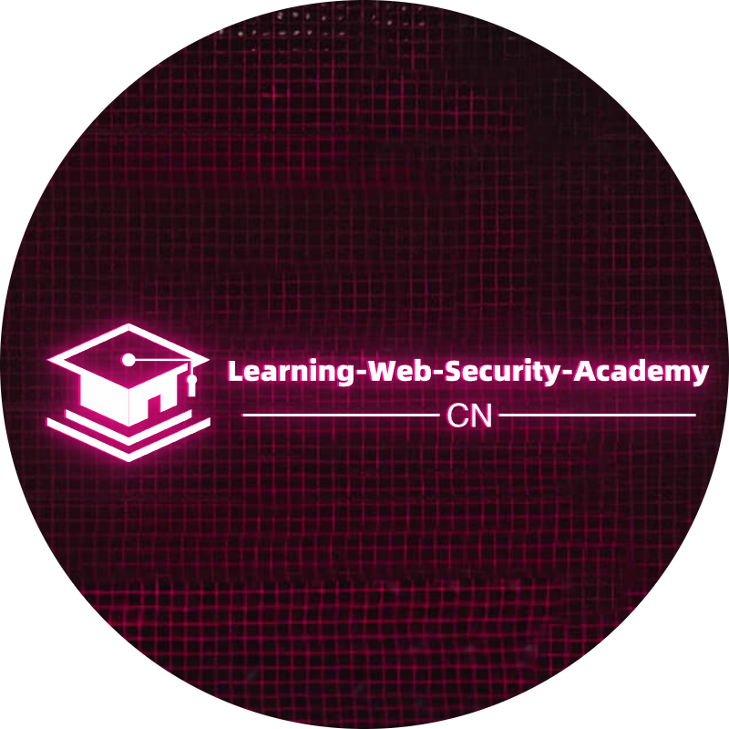
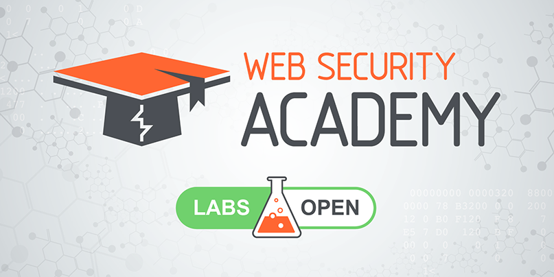

# Welcome(欢迎)

<figure><figcaption></figcaption></figure>

本项目GitHub链接：[https://github.com/Cybersecurity-Self-Learning/Learning-Web-Security-Academy-CN](https://github.com/Cybersecurity-Self-Learning/Learning-Web-Security-Academy-CN)

<figure><figcaption></figcaption></figure>

PortSwigger Web Security Academy 是网络安全领域权威的免费在线学习平台，由 Burp Suite 工具的开发商PortSwigger 所创建，专注于培养实战化 Web 应用安全技能。

以下是**PortSwigger Web Security Academy**的核心特点与优势：

#### **一、核心功能与资源**

1. **漏洞实验室（Labs）**
   * **互动式实战环境**：提供 200+ 个覆盖 OWASP Top 10 及其他高级漏洞的在线靶场（如 SQL 注入、XSS、SSRF、JWT 漏洞等）。
   * **逐步引导模式**：从基础到专家级，每个实验配备详细步骤指导和解决方案。
   * **Burp Suite 深度集成**：支持直接使用 Burp Suite 工具进行渗透测试，提升实战能力。
2. **知识模块（Learning Materials）**
   * **结构化教程**：每个主题包含原理讲解、漏洞成因、利用技巧及防御方案。
   * **视频与文章**：配套技术博客和视频，深入解析复杂攻击手法（如 Web Cache Poisoning、HTTP Request Smuggling）。
   * **CTF 风格挑战**：通过解题模式巩固技能，适合进阶训练。
3. **开发者工具支持**
   * **浏览器插件**：提供配套工具（如 Turbo Intruder、Collaborator）辅助漏洞挖掘。
   * **API 安全专题**：涵盖 OAuth 2.0、JWT、GraphQL 等现代 API 攻击技术。

#### **二、适合人群**

| **用户类型**    | **推荐内容**                   |
| ----------- | -------------------------- |
| **安全初学者**   | 基础漏洞模块（如 SQLi、XSS） + 引导式实验 |
| **渗透测试工程师** | 高级漏洞（如 SSRF、SSTI） + CTF 挑战 |
| **开发者**     | 安全编码实践教程 + 漏洞防御方案          |

#### **三、平台优势**

1. **完全免费**：所有资源开放访问，无隐藏付费内容。
2. **行业权威性**：内容由 Burp Suite 团队维护，覆盖最新攻防技术（如 WebSocket 攻击、Prototype Pollution）。
3. **实战导向**：摒弃纯理论，强调 “Learning by Hacking”。
4. **社区支持**：提供论坛讨论和官方解题思路，适合协作学习。

#### **四、学习路径示例**

1. **入门阶段**
   * 完成 **Cross-Site Scripting (XSS)** 模块的教程与基础实验。
   * 使用 Burp Suite 的 Repeater 和 Intruder 工具实践漏洞利用。
2. **进阶阶段**
   * 挑战 **OAuth 身份验证漏洞** 和 **HTTP/2 请求走私** 实验。
   * 参与 **Scoreboard** 排行榜，提升解题速度。
3. **专家阶段**
   * 研究 **Web Cache Deception** 和 **DOM Clobbering** 等前沿漏洞。
   * 提交原创漏洞报告至平台社区。

#### **五、访问方式**

* **官网**：[Web Security Academy](https://portswigger.net/web-security)
* **推荐工具**：配合 Burp Suite Professional（社区版也可完成多数实验）。

> PortSwigger Web Security Academy上的全部主题：
>
> [https://portswigger.net/web-security/all-topics](https://portswigger.net/web-security/all-topics)
>
> PortSwigger Web Security Academy上的全部实验：
>
> [https://portswigger.net/web-security/all-labs](https://portswigger.net/web-security/all-labs)[
> ](https://portswigger.net/web-security/all-topicshttps://portswigger.net/web-security/all-labs)

**总结**：PortSwigger Web Security Academy 是网络安全从业者从入门到精通的“一站式”实战平台，通过实验室驱动学习，结合顶级工具链，助力快速掌握企业级攻防技能。
